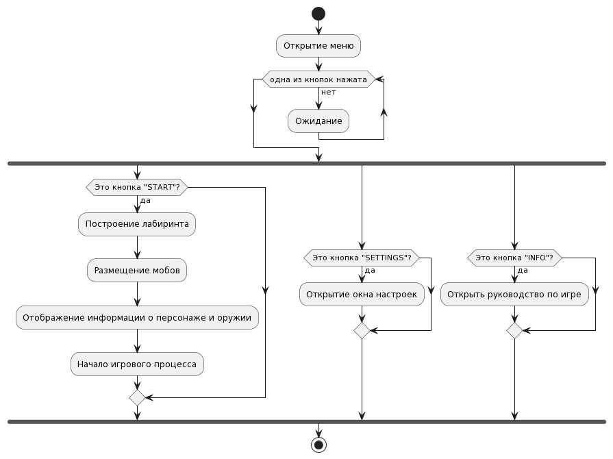

# Функциональные модели

## Демонстрация меню
- Пользователь открывает приложение
- Приложение демонстрирует меню игры
- Пользователь нажимает на одну из нескольких кнопок
- Приложение отрабатывает по сценарию в зависимости от нажатой кнопки
* [оффлайн файл](start.puml)

## Настроить громкость:
- Пользователь нажимает на кнопку "Settings" в меню.
- Приложение отображает текущую громкость звука.
- Пользователь регулирует ползунок громкости.
- Приложение сохраняет новую громкость звука.

## Узнать основные клавиши для перемещения и стрельбы:
- Пользователь выбирает опцию "INFO".
- Приложение отображает список основных клавиш для перемещения и стрельбы, а также послание создателя.
- Пользователь ознакамливается с названиями клавиш.

## Начать игру:
- Пользователь нажимает на кнопку "START" в меню.
- Приложение загружает игровой уровень.
- Персонаж спавнится в верхней левой клетке лабиринта.
- Приложение отображает лабиринт с врагами и блок с информацией о персонаже и оружии.

## Перемещать персонажа:
- Пользователь использует клавиши WASD для перемещения персонажа по лабиринту.
- Приложение отображает новое положение персонажа.

## Стрелять:
- Пользователь использует стрелки или нажатие мыши для стрельбы по врагам.
- Приложение выполняет стрельбу в заданом направлении, отображает количество патронов в оружии и статус оружия (перезаряжается или готово).

### Диаграмма

* [оффлайн файл](fire.puml)

## Получать информацию о состоянии персонажа и оружия:
- Пользователь видит блок с информацией о персонаже и оружии, который отображает текущий уровень, количество патронов в оружии, здоровье персонажа, количество живых врагов и количество денег.
- Пользователь видит health bar свой и своих врагов, подкрашенный в зависимости от количества здоровья (зеленый, желтый, красный).

## Убивать врагов:
- Персонаж должен убить всех врагов на уровне, чтобы пройти на следующий уровень.
- За каждого убитого врага персонаж получает одну монету.
- Приложение удаляет убитых врагов из лабиринта.

## Покупать улучшения:
- Пользователь может потратить 10 монет на покупку улучшений, таких как увеличение здоровья, брони или дополнительных патронов.
- Приложение уменьшает количество монет пользователя.
- Приложение применяет выбранное улучшение к персонажу.
### Диаграмма
* [оффлайн файл](buy.puml)

## Повышать уровень:
- После убийства всех врагов на уровне, игрок нажимает кнопку "Next level" для перехода к следующему уровню.
- Приложение загружает новый уровень.
- Игрок продолжает игру на новом уровне.

# Диаграммы
## Диаграмма вариантов использования
* Онлайн генерация (формат mermaid, используется инструмент Диаграммы состояний)

* [оффлайн файл](vars_of_use.puml)

